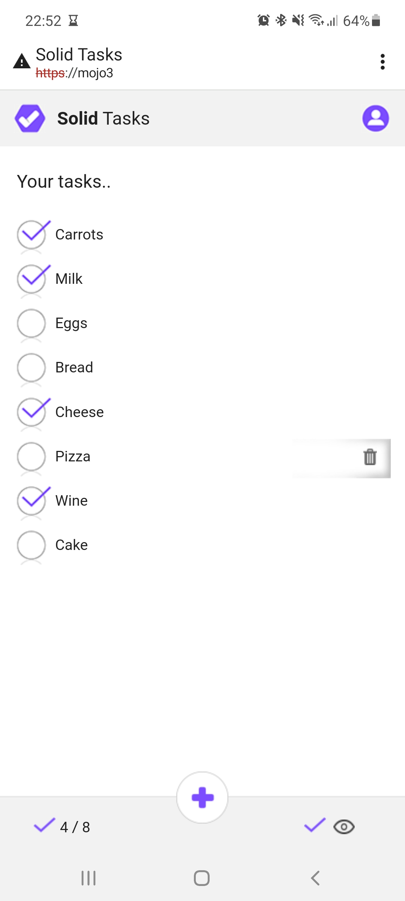

# Solid Task App

This app is based on the great work of Alain Burgeois's and his introduction to Solid with his "Solid Task App";  I just added a different UI over it!

Of all the Solid Apps i'd looked over this one was written in a particular way that didn't need any fussy build tools or special library installers. It was just nice to play around with the code.

Note: The app is for use only on a phone, to install on your phone,  open the demo link below,  then on Android Chome select from the Chrome menu option "Add to Home Screen",  this will add a little icon onto your phone home screen and allow you to open the app like your other apps.  Unfortunatly i don't have an Apple phone to test but it might be fairly similar.

The demo is [here](https://julian-cole.github.io/solid-task-app/)  (note: swipe-left to bring up the delete option)

